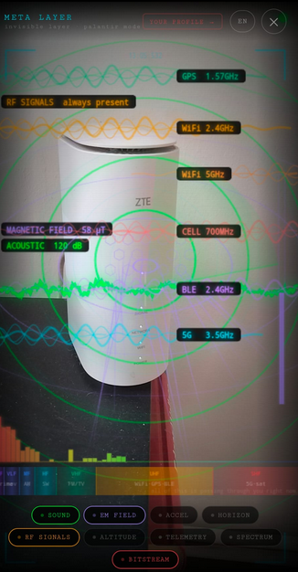
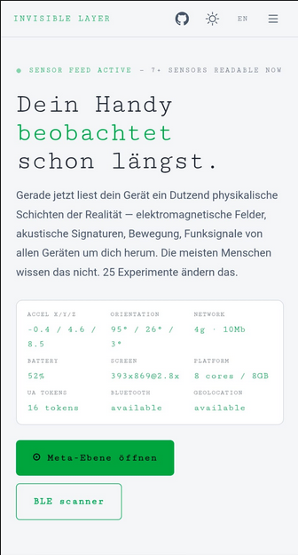
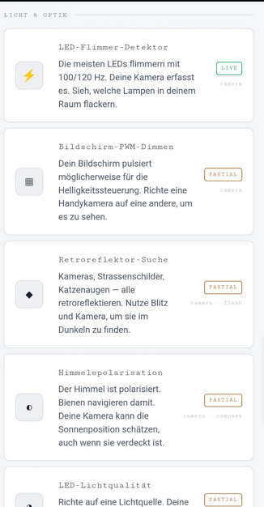
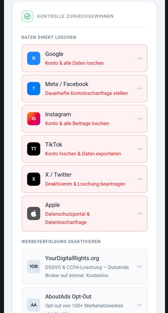

# invisible layer

> **Human rights are not subject to negotiation.**
> — RFI-IRFOS × Emergent Interaction Lab, core doctrine.


**"Is it too late?" — that is the wrong question. It has been past that since 2020.**

The right question is: *now that you see it, what do you do?*

---

> *"Wenn du siehst, dass ein Blinder auf einen Brunnen zugeht,*
> *ist es eine Sünde, still zu bleiben."*
>
> — Saadi Shirazi, *Golestan* (Persia, 13th century)
>
> *"If you see a blind man walking toward a well — it is a sin to stay silent."*

The same weight sits in scripture across traditions. Silence in the face of visible harm is not neutrality. It is complicity — and accountability for that silence does not disappear because the harm is digital.

Data collection has reached dimensions that were not conceivable in 2015. Four hundred and fifty million data points per user per day. Behavioral models precise enough to predict your next purchase, your political lean, your emotional state — before you consciously form the thought. Digital twins updated in milliseconds. None of it required your signature. Just your attention.

The entities doing this know exactly what they are building. The people it is being built on, mostly do not.

**invisible layer is our answer to the question nobody is asking loud enough.**

Not an app. Not a product. Not a company with a privacy policy nobody reads. A mirror. Open it on your phone, and for the first time you see what has been running silently this entire time.

[](https://rfi-irfos.github.io/invisible-layer/)

**open on your phone. no install. no account. no data collected. just the truth.**

---

## what this is

44 browser-based experiments that use your phone's built-in sensors and browser APIs to reveal the hidden layers of physical reality — and one profile page that shows you exactly how you look to the systems that are watching.

No app install. No account. No server. Everything runs locally in your browser.

Each experiment answers one question: *what is your phone already measuring that you didn't know about?*

The profile page answers a different question: *what do they already know about you?*

<table>
  <tr>
    <td align="center"></td>
    <td align="center"></td>
    <td align="center"></td>
    <td align="center"></td>
  </tr>
</table>

## experiments

### electromagnetic & radio
| experiment | sensor | status |
|---|---|---|
| [BLE broadcast scanner](docs/experiments/ble/) | Bluetooth LE | live |
| [EM field detector](docs/experiments/em-field/) | magnetometer | live |
| [compass anomalies](docs/experiments/compass-anomaly/) | magnetometer | partial |
| [WiFi density map](docs/experiments/wifi-density/) | WiFi RSSI | live |

### acoustic
| experiment | sensor | status |
|---|---|---|
| [full spectrum FFT](docs/experiments/acoustic/) | microphone | live |
| [mains hum detector](docs/experiments/mains-hum/) | microphone | live |
| [ultrasonic pest repellers](docs/experiments/ultrasonic/) | microphone | live |
| [room size from echo](docs/experiments/room-acoustics/) | microphone | live |
| [infrasound](docs/experiments/infrasound/) | microphone | live |

### motion & structural
| experiment | sensor | status |
|---|---|---|
| [surface resonance](docs/experiments/motion/) | accelerometer | live |
| [surface resonance v2](docs/experiments/surface-resonance/) | accelerometer | partial |
| [gait biometric](docs/experiments/gait/) | accel + gyro | live |
| [micro-seismic logger](docs/experiments/seismic/) | accelerometer | live |
| [floor-by-floor altimeter](docs/experiments/barometer/) | barometer | live |
| [keystroke timing biometric](docs/experiments/keyboard-timing/) | keyboard events | live |
| [touch biometric](docs/experiments/touch-biometric/) | touch events | live |

### light & optical
| experiment | sensor | status |
|---|---|---|
| [LED flicker detector](docs/experiments/light-flicker/) | camera | live |
| [LED quality meter](docs/experiments/led-quality/) | camera | partial |
| [screen PWM dimming](docs/experiments/screen-pwm/) | camera | live |
| [retroreflector finder](docs/experiments/retroreflector/) | camera + flash | live |
| [sky polarization](docs/experiments/sky-polarization/) | camera | live |

### biometric & body
| experiment | sensor | status |
|---|---|---|
| [face inference](docs/experiments/face-inference/) | camera (MediaPipe face mesh) | live |
| [fingerprint gate](docs/experiments/fingerprint-gate/) | fingerprint / WebAuthn API | live |
| [body sensors](docs/experiments/body-sensors/) | accelerometer + gyro | live |

### the meta layer — what you reveal
| experiment | sensor | status |
|---|---|---|
| [your passive telemetry](docs/experiments/passive-telemetry/) | all sensors | live |
| [what apps infer from motion](docs/experiments/what-you-reveal/) | accel + gyro | live |
| [network fingerprint](docs/experiments/network-fingerprint/) | navigator API | live |
| [urban canyon detector](docs/experiments/urban-canyon/) | GPS accuracy | live |
| [human density from WiFi](docs/experiments/human-density/) | WiFi probes | live |
| [font enumeration](docs/experiments/font-enumeration/) | font API | live |
| [network timing](docs/experiments/network-timing/) | fetch timing | live |
| [the full picture](docs/experiments/the-meta/) | everything | live |
| [your digital profile](docs/experiments/the-profile/) | all APIs | live |

### digital fingerprint
| experiment | sensor | status |
|---|---|---|
| [device identity](docs/experiments/device-identity/) | navigator API | live |
| [canvas fingerprint](docs/experiments/canvas-fingerprint/) | canvas API | live |
| [GPU identity](docs/experiments/gpu-identity/) | WebGL API | live |
| [audio fingerprint](docs/experiments/audio-fingerprint/) | AudioContext | live |
| [installed voices](docs/experiments/installed-voices/) | speech API | live |
| [codec map](docs/experiments/codec-map/) | media API | live |
| [WebRTC IP leak](docs/experiments/webrtc-ip-leak/) | WebRTC | live |
| [battery API](docs/experiments/battery-api/) | battery API | live |
| [storage quota fingerprint](docs/experiments/storage-quota/) | storage API | live |
| [clipboard access](docs/experiments/clipboard-access/) | clipboard API | live |
| [WebRTC TURN leak](docs/experiments/webrtc-turn/) | WebRTC | live |

---

## run locally

```bash
git clone https://github.com/rfi-irfos/invisible-layer
cd invisible-layer
python3 -m http.server 8080
# open http://localhost:8080 on your phone (same network)
```

HTTPS is required for sensor permissions. For local testing over USB:
```bash
adb reverse tcp:8080 tcp:8080
# then open http://localhost:8080 on your phone
```

## browser support

| feature | android chrome | ios safari | firefox |
|---|---|---|---|
| accelerometer/gyro | ✓ | ✓ (permission dialog) | ✓ |
| magnetometer | ✓ | partial | partial |
| microphone | ✓ | ✓ | ✓ |
| camera | ✓ | ✓ | ✓ |
| web bluetooth (BLE) | ✓ | — | — |
| barometer | ✓ | ✓ | — |

## contributing

Each experiment is a single self-contained HTML file in `docs/experiments/<name>/index.html`. Add one, open a PR.

```
docs/experiments/your-experiment/
  index.html     ← everything in one file
```

## license

MIT — use it, fork it, teach with it. The only thing we ask is that you keep pointing people toward the delete buttons.

---

## ⚠ WARNING — we are showing you a fraction

**invisible layer covers ~9 of the sensors in your pocket. Your phone has dozens more.**

This is not the full picture. This is the tip.

Every sensor in the table below can be read — by apps, by browsers (with or without asking), by the OS itself, and by data brokers whose entire business model is stitching these streams together into a behavioral model with your name on it.

### what your phone can actually sense

The table below reflects the hardware present in two typical consumer devices most people carry today: the **Apple iPhone 16** and the **Samsung Galaxy S24** — baseline models, not Pro, not Ultra. Both are in millions of pockets right now.

**motion & position**

| Sensor | What it captures | iPhone 16 | Galaxy S24 |
|---|---|:---:|:---:|
| Accelerometer (3-axis, up to 800 Hz) | Typing rhythm, heartbeat, sleep position, transport mode | ✓ | ✓ |
| Gyroscope (3-axis) | Rotation rate; gait signature alone is enough to identify you in a crowd | ✓ | ✓ |
| Magnetometer | Compass + EM field; maps your indoor position to specific rooms | ✓ | ✓ |
| Barometer | Floor-level altitude; knows which floor of which building you are on | ✓ | ✓ |
| GPS (multi-constellation) | Sub-3m outdoor; combined with cell/WiFi → sub-1m indoor triangulation | ✓ | ✓ |
| Step counter / pedometer | Continuous background counting; no permission required on Android | ✓ | ✓ |
| Gravity · linear acceleration · rotation vector | All derived from above; all logged continuously | ✓ | ✓ |
| Significant motion detector | Wakes apps when you start moving — without your knowledge | ✓ | ✓ |

**radio & proximity**

| Sensor | What it captures | iPhone 16 | Galaxy S24 |
|---|---|:---:|:---:|
| WiFi scanner | Every access point in range; maps position to building and room; probe requests broadcast your movement history | ✓ | ✓ |
| Bluetooth LE | Passive scanner hears every BLE beacon; your own broadcasts are logged by every receiver you walk past | ✓ | ✓ |
| Cell tower | Carrier, tower ID, signal strength; triangulates without GPS, works indoors | ✓ | ✓ |
| NFC | Contactless payment logs, transit card reads, location inference from NFC tags | ✓ | ✓ |
| UWB (Ultra-Wideband) | Centimeter-precision ranging between nearby devices | ✓ | — |
| Proximity sensor | Knows when phone is at your ear; infers calls without microphone access | ✓ (IR) | ✓ |

**optical & environmental**

| Sensor | What it captures | iPhone 16 | Galaxy S24 |
|---|---|:---:|:---:|
| Camera — rear | Full resolution video and stills; background access possible with certain permissions | ✓ (48 MP) | ✓ (50 MP) |
| Camera — front | Full resolution; Face ID projects 30,000 IR dots onto your face 30× per second | ✓ | ✓ |
| Ambient light sensor | Reads screen brightness indirectly; can detect what TV program, monitor, or display you are facing | ✓ | ✓ |
| Proximity sensor | Ear detection, infers call state | ✓ | ✓ |
| Thermometer (internal) | CPU and battery temp leaks ambient temperature and physical exertion | ✓ | ✓ |
| Humidity sensor | Environmental moisture | — | — |
| LiDAR scanner | Full 3D point-cloud of every room you enter | — (Pro only) | — (Ultra only) |

**biometric & audio**

| Sensor | What it captures | iPhone 16 | Galaxy S24 |
|---|---|:---:|:---:|
| Microphone (3 mics) | Continuous background access possible; ultrasonic beacons (17–22 kHz, inaudible) in stores and airports track you between zones | ✓ | ✓ |
| Face ID / TrueDepth | Infrared dot projector maps 30,000 points on your face 30× per second | ✓ | — (2D only) |
| Fingerprint scanner (under-display) | Biometric template on-device; every authentication event is logged | — (Face ID) | ✓ |
| Heart rate sensor | Continuous optical monitoring | — | — (Watch only) |

**software-layer sensors — no hardware permission needed**

| Sensor | What it captures | iPhone 16 | Galaxy S24 |
|---|---|:---:|:---:|
| Touch events | Pressure, area, coordinates, timing — sampled at full input rate | ✓ | ✓ |
| Keystroke timing biometric | Latency between keystrokes identifies you without reading any content | ✓ | ✓ |
| Battery telemetry | Level, voltage, temperature, charge rate and source — partial device fingerprint | ✓ | ✓ |
| Clipboard contents | Any app in focus can read what you copied: passwords, addresses, account numbers | ✓ | ✓ |
| Screen state | Orientation, brightness, on/off events | ✓ | ✓ |
| Canvas fingerprint | GPU renders a scene; sub-pixel output is unique per device | ✓ | ✓ |
| WebGL fingerprint | GPU model, driver version, shader precision; device identity without cookies | ✓ | ✓ |
| AudioContext fingerprint | DAC characteristics and speaker resonance; unique per hardware unit | ✓ | ✓ |
| Font enumeration | Installed fonts reveal OS, region, corporate environment | ✓ | ✓ |
| Speech synthesis voices | Installed voices reveal locale, accessibility settings, enterprise config | ✓ | ✓ |
| Installed codecs | Media format support list is a partial device fingerprint | ✓ | ✓ |
| Storage quota | Available disk space correlates with device model and usage patterns | ✓ | ✓ |
| Network request timing | TLS fingerprint, HTTP/2 stream patterns; identifies you even through a VPN | ✓ | ✓ |

**what invisible layer covers: accelerometer · gyroscope · magnetometer · barometer · microphone · camera · BLE · GPS accuracy · navigator fingerprint**

That is 9 streams out of the above.

**To see the full sensor stack on your own device:** download [Phyphox](https://phyphox.org) (open source, RWTH Aachen University). It exposes every hardware sensor your phone physically has, with live graphs, raw data export, and no data collection. It is the honest version of what every data broker does silently.

> The difference between Phyphox and a data broker is one thing: Phyphox shows you the data. The broker sells it.

---

*built by [rfi-irfos](https://ternlang.com) · no VC funding · no data collected · no regrets*

*The data brokers have a 450-million-point behavioral model on you.*
*You now have one URL to start deleting it.*
*Seems like a fair trade.*

## Contributors

Built by the RFI-IRFOS core team — see [CONTRIBUTORS.md](CONTRIBUTORS.md).
